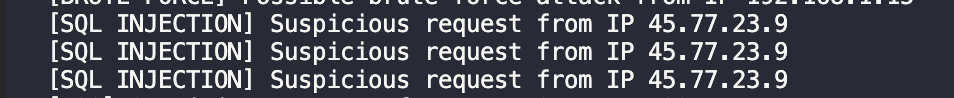
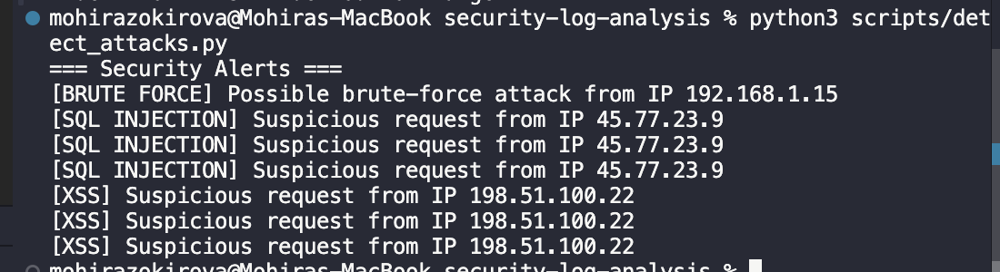

## Security Log Analysis and Attack Detection Report

### Overview
This report documents the analysis of web server access logs to identify suspicious and malicious activity. The objective of the project was to simulate a blue-team detection workflow by identifying common attack patterns through log analysis.

All logs used in this project were **simulated** and analyzed in a **local, controlled, and ethical environment**.

---

### Log Source
The analyzed data consists of simulated Apache/Nginx-style access logs representing a mix of normal user behavior and malicious activity.

Log file:
- `logs/access.log`

---

### Detection Methodology
A Python-based detection script was developed to parse log entries and identify suspicious patterns using rule-based detection.

The following techniques were used:
- Log parsing and normalization
- Pattern matching using regular expressions
- IP-based correlation
- Alert generation based on predefined thresholds

---

### Detected Attack Types

#### 1. Brute-Force Authentication Attempts
Multiple failed login attempts (`POST /login` with HTTP status `401`) originating from the same IP address within a short time window were detected.

Detection logic:
- Same IP address
- Repeated failed authentication attempts
- Alert triggered after five failures

Example alert:

---

#### 2. SQL Injection Attempts
Requests containing common SQL injection patterns were identified within URL parameters.

Detected indicators included:
- `' OR 1=1--`
- `' OR 'a'='a`
- SQL comment markers (`--`)

Example alert:

---

#### 3. Cross-Site Scripting (XSS) Attempts
Requests containing HTML and JavaScript injection patterns were detected.

Detected indicators included:
- `<script>` tags
- `onerror` event handlers
- `` tag injection

Example alert:

---

### Results
The detection script successfully identified:
- Brute-force login attempts
- SQL injection payloads
- Cross-site scripting attempts

Each detection generated clear alerts indicating the attack type and source IP address.

---

### Limitations
This project uses rule-based detection and simulated log data. While effective for known attack patterns, this approach may not detect advanced or obfuscated attacks without additional correlation or behavioral analysis.

---

### Conclusion
This project demonstrates a blue-team approach to security monitoring by analyzing web server logs and detecting common attack techniques. The results highlight the importance of log analysis and alerting as part of a defensive security strategy.

---

### Skills Demonstrated
- Log analysis and parsing
- Blue-team detection techniques
- Pattern-based attack detection
- Python scripting for security monitoring
- SOC-style alert generation

### Evicence
